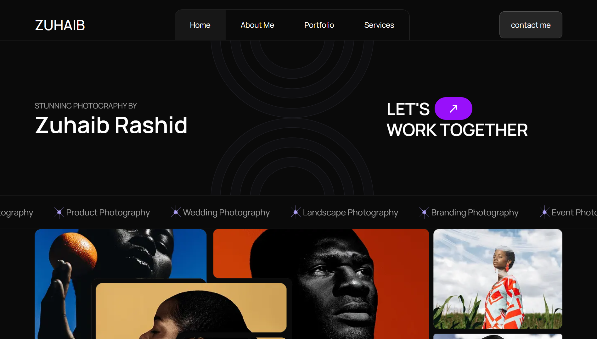

# 📸 Lenscapes — A Modern Photographer Portfolio

**Lenscapes** is a modern, elegant, and fully responsive photographer portfolio web app built with **Next.js**, **React.js**, **TypeScript**, **Tailwind CSS**, and **Framer Motion**. It beautifully showcases photography work, tells stories through visuals, and leaves visitors inspired with its clean design and fluid animations.

<!-- Add a high-quality GIF of your project's UI and animations here -->


### 🌐 **Live Demo:** [https://lenscapes.netlify.app/](https://lenscapes.netlify.app/)

---

## 🚀 Tech Stack & Tools


---

## ✨ Key Features

*   📷 **Beautiful Gallery**: Showcases high-quality photos in a dynamic, responsive grid layout.
*   🧭 **Smooth Navigation**: Seamless page transitions powered by **Framer Motion** for an elegant user experience.
*   🌙 **Modern & Minimal Design**: A distraction-free interface that puts the focus entirely on the photography.
*   📱 **Fully Responsive**: Flawless viewing experience on all devices, from mobile phones to desktops.
*   ⚡ **Optimized for Performance**: Built with **Next.js 14** features like the App Router, Server-Side Rendering (SSR), and Image Optimization for fast load times.
*   🧠 **Type-Safe Codebase**: A clean, modular, and scalable architecture written in **TypeScript**.

---

## 📁 Project Structure

The project follows a clean and intuitive structure to keep the codebase organized and maintainable.


---

## 🛠️ Getting Started

Follow these steps to set up and run the project locally.

1.  **Clone the repository:**
    ```
    git clone https://github.com/Zuhaib-dev/photography.git
    ```

2.  **Navigate to the project directory:**
    ```
    cd lenscapes
    ```

3.  **Install dependencies:**
    ```
    npm install
    ```

4.  **Run the development server:**
    ```
    npm run dev
    ```

5.  **Open your browser** and visit [http://localhost:3000](http://localhost:3000).

---

## 💡 Design Philosophy

> “Every photograph tells a story—Lenscapes is the stage.”

This portfolio is built on the principles of immersive visuals, subtle motion, and fluid interactions. The design lets the photography shine with minimal distraction, creating a memorable digital gallery.

---

## 👋 Connect with Me

Created by **Zuhaib Rashid**. Let's connect!

*   **🌍 Portfolio:** [https://www.zuhaibrashid.com/](https://www.zuhaibrashid.com/)
*   **💼 LinkedIn:** [https://www.linkedin.com/in/zuhaib-rashid-661345318/](https://www.linkedin.com/in/zuhaib-rashid-661345318/)
*   **🐙 GitHub:** [https://github.com/Zuhaib-dev](https://github.com/Zuhaib-dev)
*   **🐦 X (Twitter):** [https://x.com/xuhaib_x9](https://x.com/xuhaib_x9)

---

## 📜 License

This project is licensed under the **MIT License**. Feel free to use, modify, and distribute it as you see fit.

⭐ If you found this project helpful or inspiring, please give it a star on GitHub!

Thanks For Visting👍
Fell free to Contact for any Freelance project or any source code! at zuhaibrashid01@gmail.com

Also if anybody wants to make changes he can . 🙌 


 